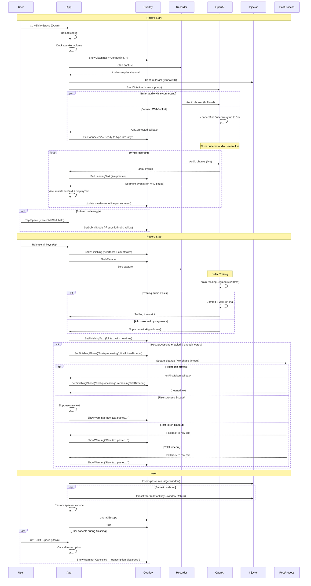

# Runtime Flow

This page is the detailed path for one dictation session.

## Sequence Diagram

## Startup

When `vocis serve` runs:

1. [`cmd/vocis/serve.go`](/home/fred/git/vtt/cmd/vocis/serve.go) starts a session log and loads config.
2. `serve.go` creates the X11 platform implementations (overlay, injector, hotkey registrar).
3. `serve.go` injects them into [`internal/app/app.go`](/home/fred/git/vtt/internal/app/app.go) via `app.New(cfg, deps)`.
4. [`internal/securestore/keyring.go`](/home/fred/git/vtt/internal/securestore/keyring.go) resolves the OpenAI API key.
5. `app.Run()` registers the hotkey (with fallback candidates) and enters the event loop.

## Config Reload

Config is reloaded at the start of each recording. This allows changes to vocabulary, prompt hints, streaming settings, recording settings, and post-processing to take effect without restarting vocis. The OpenAI client is recreated with the new config on each reload.

## Record Start

When the hotkey starts dictation:

1. Config is reloaded from disk.
2. Audio ducking lowers the default speaker volume (configurable via `recording.duck_volume`).
3. [`internal/platform/x11/overlay.go`](/home/fred/git/vtt/internal/platform/x11/overlay.go) shows the overlay immediately with "○ Connecting..." status.
4. The overlay repositions to the monitor where the mouse pointer is.
5. [`internal/recorder/recorder.go`](/home/fred/git/vtt/internal/recorder/recorder.go) starts local microphone capture immediately.
6. The injector captures the active target window after capture has already started so focus can be restored later.
7. [`internal/openai/transcribe.go`](/home/fred/git/vtt/internal/openai/transcribe.go) starts a `DictationSession`.
8. The `DictationSession` creates the realtime transcription session through the OpenAI SDK and connects the WebSocket. If the connect fails, it retries up to 3 times (2s timeout per attempt).
9. Audio chunks that arrive before the WebSocket is ready are buffered in memory inside the dictation session (`connectAndBuffer`).
10. Once the WebSocket is ready, the overlay updates to "● Ready to type into {window}" and buffered audio is flushed, then live audio continues streaming (`streamAudio`).

### Submit Mode

While recording with Ctrl+Shift held, tapping Space toggles submit mode. The hotkey system emits a `Tap` event (distinct from `Down`/`Up`) when Space is re-pressed while already in the "down" state. Auto-repeat key events are filtered out — only genuine release+press cycles trigger the toggle.

The overlay shows a throbbing yellow "⏎ submit" indicator when submit mode is enabled. On release, the text is pasted and `xdotool key --window <id> Return` is sent to the target window.

## Record Stop

When the hotkey stops dictation:

1. [`internal/app/app.go`](/home/fred/git/vtt/internal/app/app.go) stops local recording.
2. The Escape key is temporarily grabbed for the finishing state.
3. The overlay switches to the "Finishing" state with a heartbeat wave animation, showing the accumulated text and a countdown timer. The countdown is proportional to recording duration: `max(5s, duration/5)`.
4. The user can press the hotkey during this state to cancel the in-flight transcription. The overlay shows "Cancelled — transcription discarded".
5. [`internal/openai/transcribe.go`](/home/fred/git/vtt/internal/openai/transcribe.go) finalizes the `DictationSession` via `collectTrailing`:
   - `drainPendingSegments`: collects any segment results that arrived between recording stop and finalization (250ms window).
   - If all audio was consumed by live segments and no trailing audio remains, finalization returns immediately.
   - Otherwise, `stream.Commit` sends the trailing audio and `waitForFinal` waits for the transcript with a proportional timeout.
   - Empty commit errors are expected when all audio was consumed by segments and are handled gracefully.
6. The overlay updates to show the complete transcription text (segments + trailing) with newlines preserved.
7. If post-processing is enabled and the text has enough words (`postprocess.min_word_count`):
   - The overlay countdown starts with `first_token_timeout_seconds` (default 10s). This is how long we wait for the model to start responding.
   - When the first token arrives, the countdown extends to the remaining `total_timeout_seconds` (default 15s) for the full streamed response.
   - If no first token arrives within the first-token timeout, raw text is pasted immediately (the model is likely stuck).
   - Pressing Escape during either phase skips post-processing and pastes raw text.
   - If the stream errors or returns empty, raw text is pasted with a yellow warning overlay.
8. The accumulated segment text plus any trailing transcript is combined and inserted as a single paste.
9. If submit mode was toggled on, Enter is pressed on the target window.
10. Audio ducking restores the speaker volume.
11. The Escape key grab is released.

## Insert

After transcription completes:

1. [`internal/platform/x11/injector.go`](/home/fred/git/vtt/internal/platform/x11/injector.go) restores focus to the original window.
2. The transcript is inserted via clipboard paste or direct typing depending on config.
3. Terminal windows use the configured terminal paste shortcut.
4. If submit mode is on, `xdotool key --window <id> Return` is sent to the target window.
5. The overlay hides.

## Segmented Streaming

Server VAD is always enabled. While the hotkey is held:

1. OpenAI server VAD detects pauses.
2. Completed phrases are emitted as segment events from the dictation session.
3. [`internal/app/app.go`](/home/fred/git/vtt/internal/app/app.go) accumulates segment text in `recordingState.liveText` (for pasting) and `recordingState.displayText` (for the overlay, with newlines between segments).
4. The overlay displays each segment on a separate line, growing vertically as text accumulates. Partial transcription text is prepended with the accumulated segments so previously completed text stays visible.
5. On release, the accumulated text plus any trailing finalize text is combined and pasted into the target window as a single insertion.

Segments are never typed into the target window during recording. This avoids corrupting the X11 keymap state with `xdotool keyup` while the user is still holding the hotkey.

## Overlay Animations

The overlay uses several animation modes:

- **First appearance** (e.g., hotkey pressed when overlay is hidden): slides down while fading in over 320ms. Opacity ramps linearly; slide position uses ease-out cubic.
- **State transitions** (e.g., Listening → Finishing): true pixel-level crossfade over 80ms. The previous frame is captured, the new state is applied, and the two frames are alpha-blended in software.
- **Final hide** (auto-hide timer or manual dismiss): slides up while fading out over 320ms with ease-in cubic for the slide.
- **Heartbeat wave** (Finishing state): bars pulse with a lub-dub rhythm while transcription is being finalized.
- **Submit hint** (Listening state with submit mode): throbbing yellow "⏎ submit" text next to the title suffix, driven by the wave phase.

## Overlay Positioning

The overlay centers on whichever monitor the mouse pointer is on, detected via Xinerama + `xproto.QueryPointer`. Position is recalculated each time the overlay appears.

## Overlay Text Configuration

All overlay strings are configurable via the `overlay.*` section of the config file. Templates use named `{placeholders}` (e.g., `{window}`, `{shortcut}`, `{attempt}`, `{max}`, `{phase}`) expanded at runtime. Missing placeholders are left as-is. Validation warns on startup if expected placeholders are missing.

## Tracing

When telemetry is enabled, the following OpenTelemetry spans are emitted per dictation session:

- `vocis.dictation` — root span covering the full session lifecycle
  - Attributes: `target.window_id`, `target.window_class`, `hotkey_mode`, `submit_mode`, `recording.bytes`, `recording.duration`, `transcription.total_chars`, `transcription.live_chars`, `transcription.trailing_chars`
  - Events (overlay state transitions):
    - `overlay.connecting` (`attempt`, `max`) — WebSocket connection attempt
    - `overlay.connected` — connection established
    - `overlay.submit_mode` (`enabled`) — user toggled submit mode
    - `overlay.finishing` (`timeout`, `auto_stop`) — recording stopped, entering finish phase
    - `overlay.phase.wait` (`timeout`) — post-processing wait phase started
    - `overlay.warning` (`reason`) — warning shown (e.g. `postprocess_skipped`)
    - `overlay.success` — transcription inserted successfully
  - Child spans:
    - `vocis.recorder.start` — PulseAudio client init and stream creation
    - `vocis.recording.active` — the user speaking (from dictation start to release)
    - `vocis.openai.connect` — WebSocket dial and realtime session setup (may appear multiple times on retry)
    - `vocis.recorder.stop` — stream stop and resource cleanup
    - `vocis.transcribe.finalize` — post-recording finalization
      - `vocis.transcribe.drain` — drain pending segment finals (250ms window)
      - `vocis.transcribe.commit` — commit trailing audio buffer to OpenAI
      - `vocis.transcribe.wait_final` — wait for OpenAI to return the trailing transcript
    - `vocis.postprocess` — LLM cleanup with two-phase streaming timeout
      - Attributes: `input.length`, `model`, `output.length`, `skipped`, `postprocess.first_token_timeout_sec`, `postprocess.total_timeout_sec`, `postprocess.error`
      - Events: `postprocess.streaming_request_sent`, `postprocess.first_token_received` (`elapsed`), `postprocess.first_token_timeout` (`timeout`), `postprocess.streaming_complete` (`elapsed`), `postprocess.empty_response`, `postprocess.cancelled_by_user`
    - `vocis.inject` — text insertion into the target window
      - `vocis.inject.focus` — window activate and modifier key release
      - `vocis.inject.paste` or `vocis.inject.type` — clipboard paste or xdotool type

`vocis.inject.capture_target` runs before the dictation span to identify the active window.

## Short Recordings

Very short recordings are treated as a silent cancel:

- [`internal/recorder/recorder.go`](/home/fred/git/vtt/internal/recorder/recorder.go) returns `ErrRecordingTooShort`
- [`internal/app/app.go`](/home/fred/git/vtt/internal/app/app.go) catches that and hides the overlay
- no user-facing error is shown for that case

## Error Handling

Errors are translated to user-friendly messages in the overlay:

- Network timeouts → "Could not connect to OpenAI (network timeout)"
- Context deadline → "Timed out waiting for transcription"
- Empty audio buffer → "No speech detected" (yellow warning, not red error)
- Post-processing failure → "Raw text pasted — cleanup was skipped" (yellow warning)
- Cancellation → "Cancelled — transcription discarded" (yellow warning)

See [`debugging.md`](/home/fred/git/vtt/docs/debugging.md) for logs, tracing (Jaeger API), and diagnostic tips.

## Verification Standard

This repo intentionally uses a high bar before calling work done:

- Test-Driven Development (TDD) for bug fixes: write a failing test first, then fix
- unit tests where they make sense
- successful build
- local runtime verification for behavior changes whenever feasible

That rule is summarized in [`AGENTS.md`](/home/fred/git/vtt/AGENTS.md).
